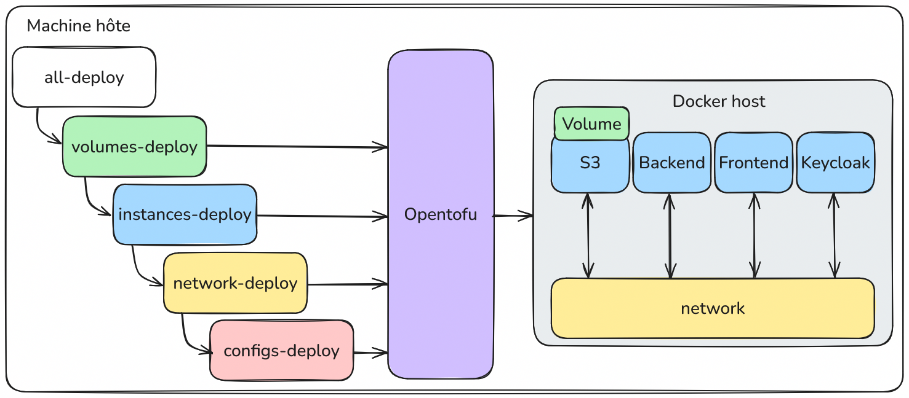

# Projet SpawnIt

**Auteurs :** Massimo Stefani et Timothée Van Hove

> [!IMPORTANT]
> Ce projet est un *proof‑of‑concept* pédagogique réalisé dans le cadre d’un cours. 
> Il est **fortement déconseillé de l’utiliser en production**: aucune mesure de sécurité robuste n’a été implémentée (mots de passe stockés en clair, absence de protocoles de chiffrement ou d’authentification renforcée, etc.). 
> Utilisez‑le exclusivement à des fins d’apprentissage et d’expérimentation.

## 1. Introduction

SpawnIt est une application **«Infrastructure‑as‑Code pour tous»** qui s’appuie intégralement sur le moteur d’orchestration **OpenTofu** (fork communautaire de Terraform). Son objectif: rendre le déploiement et la destruction de services techniques aussi simples qu’un clic, tout en conservant la puissance d’une description déclarative.

> *Décrire l’état voulu plutôt que la procédure pour y parvenir.*

Cette application permet de provisionner des services complets (bases de données, serveurs de jeu, plateformes DevOps, etc.) très facilement, qu'ils soient exécutés localement via Docker ou dans le cloud via AWS EC2.

## 2. Contexte

Nous avons retenu OpenTofu, un moteur d’infrastructure open‑source issu du projet Terraform. Contrairement à Terraform, OpenTofu conserve une licence ouverte et bénéficie du soutien de la Linux Foundation. OpenTofu permet de décrire des infrastructures sous forme de fichiers `.tf` et de piloter leur mise en place avec des commandes simples (`init`, `plan`, `apply`, `destroy`).

Note: Il se peut que vous rencontriez des références à Terraform dans le code ou la documentation.

### Application auto‑déployée et double approche IaC / API‑First

SpawnIt n’est pas seulement un orchestrateur d’infrastructure: **il se déploie lui‑même à l’aide d’OpenTofu**. Nous exploitons deux voies complémentaires qui illustrent la flexibilité du projet:

1. **IaC traditionnelle – scripts OpenTofu**: toute l’infrastructure d’hébergement de SpawnIt (réseau, volumes persistants, conteneurs système, etc.) est décrite dans des modules OpenTofu conservés dans notre dépôt Git (versionnés via tags Git). Des scripts shell (`all-deploy.sh`, `network-deploy.sh`, …) appellent successivement les commandes Opentofu pour créer ou mettre à jour cet environnement.
2. **API‑First – infrastructure «as‑a‑Service»**: côté utilisateur, aucune ligne de code Terraform n’est exposée. Une requête HTTP décrivant un service est convertie à la volée en fichiers `.tf`, puis exécutée par OpenTofu. Nous avons cherché à répliquer à notre échelle ce que fait AWS avec CloudFormation: décrire une pile, l’appliquer, et obtenir un service prêt à l’emploi sans manipuler directement la couche IaC. On demande une base de données ou un cluster de jeu et, quelques secondes plus tard, le service est opérationnel.

Ce document décrit **les deux aspects complémentaires** de SpawnIt: d’une part l’architecture de l’infrastructure déployée avec OpenTofu (conteneurs, modules, scripts), et d’autre part la logique métier (API, orchestrateur, interface utilisateur) qui permet à SpawnIt de proposer une expérience « as-a-Service ».

La suite est divisée en deux sections claires: d’abord l’infrastructure (présentée ici), puis la couche métier (plus bas dans ce même document).

## 3. Prérequis

SpawnIt nécessite seulement deux outils installés localement:

* **Docker**: Testé avec la version>=28.0.0, mais toute version récente devrait convenir.
* **OpenTofu CLI**: Testé avec la version>=1.9.

## 4. Infrastructure - IaC traditionnelle

### 1. Choix Technologiques
Sans providers, un code OpenTofu ne peut rien faire. Nous avons choisi d’utiliser les providers suivants pour répondre à nos besoins :

- Un provider **Docker** pour déployer localement des services dans des conteneurs.
- Un provider **Keycloak** pour deployer un serveur d'authentification et de gestion des utilisateurs.
- Un provider **MinIO** pour déployer un server de stockage compatible S3, qui servira utilisé comme datastore principal pour les états OpenTofu des différentes infrastructures déployées (via la configuration du backend S3 d'OpenTofu). Aussi utilisé pour les configurations de service spécifiques à chaque client et les templates de service de base qui sont servis au frontend.

> [!NOTE] 
> Les providers utilisés pour Docker et MinIO ne sont pas des providers officiels, mais des providers communautaires maintenus par la communauté OpenTofu.

### 2. Architecture

L’architecture repose sur un découplage entre la présentation, la logique d’orchestration, et l’infrastructure cible. Elle est conçue de manière modulaire et stateless, avec une exécution conteneurisée, un backend unique pilotant OpenTofu, et un stockage persistant via S3. Le backend agit comme point de convergence, en orchestrant toutes les interactions entre les autres composants.

#### Vue d’ensemble des conteneurs

| Conteneur          | Image                          | Volumes persistants |
| ------------------ | ------------------------------ |---------------------|
| `spawnit-backend`  | `ghcr.io/spawnit/backend`      | N/A                 |
| `spawnit-frontend` | `ghcr.io/spawnit/frontend`     | N/A                 |
| `minio`            | `minio/minio:latest`           | `minio-data`        |
| `keycloak`         | `quay.io/keycloak/keycloak:24` | `keycloak-data`     |


**Backend**

Le backend est une application Node.js conteneurisée, qui expose une API REST et un canal Server-Sent Events (SSE). Il encapsule également l’exécution locale de commandes OpenTofu.

**Frontend**

Le frontend est une application web statique, déployée dans un conteneur Docker distinct. Il ne contient aucune logique métier et ne connaît ni la structure des fichiers Terraform ni l’infrastructure cible. Il interagit exclusivement avec l’API backend. 

**S3 (MinIO)**

Le stockage des fichiers est entièrement externalisé sur ce serveur S3.

**Keycloak**

Keycloak est utilisé pour gérer l’authentification des utilisateurs via OpenID Connect. Il permet de sécuriser l’accès à l’interface web. Keycloak est configuré pour fonctionner en mode autonome, avec un volume persistant pour conserver les données des utilisateurs et des configurations.
### 3. Déploiement

Pour comprendre le déploiement de SpawnIt, il convient de se concentrer sur les quatre dossiers racine du projet :

- `instances/`: contient le code principal pour le déploiement des conteneurs applicatifs (backend, frontend, Keycloak, MinIO).
- `network/`: gère la création du réseau Docker utilisé par les différents services.
- `volumes/`: définit les volumes Docker persistants nécessaires au bon fonctionnement des services.
- `configs/`: configure les services déployés, par exemple la création des buckets MinIO ou l’initialisation d’un realm Keycloak.

Dans chaque dossier, on trouve :
- des fichiers `*.auto.tfvars.json` qui définissent les valeurs propres à l'infrastructure de ce composant ;
- un fichier `variables.tf` qui déclare les variables attendues et fournit leur description ;
- un fichier `main.tf` contenant la logique de provisionnement spécifique à chaque composant.

>[!NOTE] 
> - Les bonnes pratiques OpenTofu recommandent de séparer la déclaration des variables d’entrée (`variables.tf`) de leurs valeurs concrètes (`*.auto.tfvars.json`). Cela permet la réutilisation des modules.
> - Les fichiers `*.auto.tfvars.json` sont chargés automatiquement par OpenTofu lors de l’exécution, ce qui simplifie la gestion des variables par environnement.
> - En principe, il est recommandé de séparer les valeurs par environnement (développement, production, etc.) via des fichiers nommés `*.<env>.auto.tfvars.json`. Cependant, dans notre cas, nous avons choisi de regrouper les variables par module pour simplifier la structure du projet.

Pour automatiser le déploiement de l’application, nous avons mis en place des scripts shell qui encapsulent chacun une étape du provisioning. 
Ces scripts n’exécutent pas des commandes Docker, mais appellent systématiquement OpenTofu avec les fichiers de configuration appropriés.

Le script `all-deploy.sh` est le point d’entrée principal. Il déclenche successivement quatre sous-scripts.

- Le script `volumes-deploy.sh` crée les volumes Docker persistants nécessaires à certains services (MinIO, Keycloak).
- Le script `network-deploy.sh` crée le réseau Docker auquel tous les conteneurs applicatifs seront connectés.
- Le script `instances-deploy.sh` déclare les conteneurs de l’application (S3, Backend, Frontend, Keycloak) en utilisant le provider Docker.
- Enfin, `configs-deploy.sh` applique des modules supplémentaires pour injecter des configurations spécifiques dans les services lancés, par exemple la création de buckets dans MinIO ou l’initialisation d’un realm Keycloak.

Chaque script utilise son propre répertoire de travail, appelle `tofu init`, puis applique l’infrastructure avec `tofu apply -auto-approve`. L’approche est modulaire, idempotente et parfaitement compatible avec une intégration CI/CD.

Ce choix a été fait pour garantir que chaque étape du déploiement est indépendante et peut être testée ou modifiée sans affecter les autres. Cette granularité nous permet de détruire ou de mettre à jour des parties spécifiques de l'infrastructure sans avoir à redéployer l'ensemble de l'application.

> [!NOTE] 
> - Avec OpenTofu, il est techniquement possible de cibler des ressources précises à détruire ou modifier. Toutefois, **cela est déconseillé** dans la pratique : une suppression partielle peut rompre les dépendances implicites du graphe (DAG) d’infrastructure. Des ressources dépendantes risquent de rester orphelines, causant des incohérences difficiles à corriger automatiquement.
> - Un délai de 20 secondes est introduit entre chaque étape de déploiement. Ce délai permet de s’assurer que les conteneurs sont correctement initialisés avant de passer à l’étape suivante et eviter les erreurs liées à des ressources non prêtes.


C’est là l’un des aspects les plus intéressants de cette architecture : le déploiement de SpawnIt lui-même est réalisé en appliquant exactement la même logique que celle utilisée pour déployer n’importe quel service depuis l’interface web. Les modules, les scripts, la structure des variables et le moteur d’exécution sont identiques. En d’autres termes, l’application se déploie avec les mêmes mécanismes qu’elle met à disposition de ses utilisateurs.



### 4. Modularité et réutilisabilité

```
modules/
├── common/
│   ├── configs/
│   │   ├── idp/
│   │   │   ├── client/       # Déclaration d'un client Keycloak
│   │   │   ├── realm/        # Définition d'un realm Keycloak
│   │   │   └── user/         # Création d'un utilisateur Keycloak
│   │   └── s3/
│   │       ├── bucket/       # Création d'un bucket MinIO/S3
│   │       ├── content/      # Upload de contenu dans un bucket
│   │       ├── file/         # Ajout de fichier individuel
│   │       └── folder/       # Création de dossier logique
│
├── docker/
│   ├── instances/            # Lancement d'un conteneur (générique)
│   ├── network/              # Création d’un réseau Docker
│   └── volumes/              # Déclaration de volumes Docker
```


## 6. Workflow

SpawnIt utilise un enchaînement d’étapes gérées par le backend, avec une séparation entre les phases de génération de configuration, de provisioning, et de supervision. L’ensemble du système est gérée via une API ou chaque endpoint déclenche des actions Terraform en local, sur la base de fichiers centralisés dans S3.

**Génération de configuration et persistance dans S3**

Tous les services deployables sont basés sur des templates JSON prééxistants. Lorsqu’un utilisateur choisit un service à déployer et renseigne ses paramètres dans l’interface, ces informations sont envoyées au backend. Le backend les encapsule dans une structure standardisée conforme au schéma d’entrée des modules Terraform. Il ajoute dynamiquement des valeurs et sérialise l’ensemble dans un fichier `terraform.tfvars.json`. Ce fichier est ensuite stocké sur S3.

Cette étape ne déclenche aucun déploiement. Elle sert uniquement à constituer une base déclarative persistée, qui pourra ensuite être appliquée ou modifiée. Le backend ne conserve aucun état local. Toutes les informations sont reconstruites à partir des fichiers distants, ce qui permet de redémarrer le backend à tout moment sans perte d’état.


**Préparation du répertoire de travail**

Pour chaque opération Terraform (`plan`, `apply`, `destroy`), le backend crée à la volée un répertoire de travail sous `./workdirs/{clientId}/{serviceId}/`. Il y télécharge depuis S3 tous les fichiers associés (variables et état). La logique d’initialisation est encapsulée dans une instance `OpenTofuCommand`, qui passe le contexte `(clientId, serviceId)`.

Avant chaque exécution, cette instance appelle `tofu init` avec les bons paramètres backend (bucket, chemin du fichier d’état, région, endpoint MinIO ou AWS, etc.), en injectant ces informations via des variables d’environnement. Cette initialisation est faite à froid pour chaque exécution, sauf si elle a déjà été faite dans le contexte courant. Elle est donc idempotente, mais évite les recharges inutiles.


**Validation, planification, application et destruction**

Avant de lancer un plan sur un service, le backend vérifie que la couche réseau associée est existante et conforme. Il le fait en lançant un plan sur le module réseau du provider spécifié (`network/local` ou `network/aws`) avec son propre fichier de variables. Si le plan indique une divergence, ou si le fichier de configuration est manquant, l’opération principale est bloquée. Cette validation réseau est déduite dynamiquement à partir des paramètres du service (`provider` et `network_name`), ce qui permet à deux services d’un même client de partager une même couche réseau tout en étant déployés indépendamment.

Une fois le répertoire de travail prêt et le réseau validé, le backend lance la commande `tofu plan`. La sortie de cette commande est capturée en flux et transmise au client via SSE. Le backend analyse également cette sortie pour en déduire un statut formel : "compliant" (aucune modification à prévoir), "drifted" (modifications planifiées), ou "error" (exécution échouée).

Si l’utilisateur confirme le plan, la commande `tofu apply` est déclenchée. Elle suit le même mécanisme que `plan` : création d’un processus local, capture de la sortie, transmission par SSE. L’apply est exécuté avec l’option `-auto-approve` pour garantir l’absence d’interaction.

La destruction (`tofu destroy`) suit le même schéma et est toujours précédée d’un plan implicite pour vérifier l’état du service à supprimer. Le backend ne fait pas de nettoyage automatique des répertoires de travail, mais ceux-ci peuvent être supprimés sans conséquence, puisque l’état est toujours sauvegardé dans S3.


**Supervision et gestion des jobs**

SpawnIt utilise une boucle de planification continue sur tous les services. Un `setInterval` exécute toutes les 10 secondes un `plan` sur le service ciblé. Le résultat est envoyé aux clients connectés. Cette fonctionnalité est utile pour détecter des dérives manuelles (modifications de conteneurs ou d’instances en dehors de SpawnIt), sans avoir besoin d’un agent sur la machine cible.

Chaque exécution de `apply`, `destroy` ou `plan` est associée à un UUID et conservée dans une table en mémoire. Cela permet à l’utilisateur d’annuler un job en cours via une requête dédiée, ce qui envoie un `SIGTERM` au processus sous-jacent. En cas de plantage du backend, cette table est perdue, mais comme les processus sont exécutés localement et encapsulés, les effets secondaires sont limités. Les jobs terminés sont automatiquement retirés de la table.


## 7. Discussion et limites

Notre architecture modulaire permet à chaque composant, que ce soit le backend, les modules Terraform, ou les scripts de déploiement d'être facilement réutilisables et extensibles. Le modèle de configuration utilisant les templates et les variables rend l’extension du catalogue de services extrêmement simple. L’ajout d’un nouveau service ne nécessite aucune modification du backend ni du frontend : il suffit de déposer un nouveau fichier template et de l’enregistrer dans le fichier `catalog.json`. Le fait que l'application soit auto-déployable est une preuve de cohérence. Cette boucle fermée illustre bien l’intention initiale du projet de tirer parti de l'interface déclarative pour la gestion d’infrastructure.

Certaines limitations subsistent. La persistance de l’état repose sur le backend S3. Si ce dernier devient indisponible, l’application devient inutilisable, car le backend ne conserve aucun cache local. Ce choix est volontaire (stateless complet), mais introduit une dépendance forte à la disponibilité de S3. Enfin, l’expérience utilisateur peut être altérée en cas d’erreurs de configuration. L’application ne valide pas de manière exhaustive les champs du formulaire utilisateur, ce qui peut provoquer des erreurs à l’exécution de Terraform difficiles à diagnostiquer pour un utilisateur non technique. Ce point pourrait être amélioré par une phase de pré-validation plus stricte côté backend.


## 8. **Conclusion**

Notre projet démontre qu’il est possible de proposer une interface de déploiement légère et déclarative, sans sacrifier la flexibilité ni l’extensibilité. L’approche déclarative a joué un grand rôle dans la structuration du projet. En isolant chaque étape du déploiement et en les décrivant comme des modules indépendants, l’architecture reste lisible, reproductible et facilement testable. Cette structure a également facilité la mise en place de l’auto-hébergement, qui démontre la cohérence du modèle choisi.

Plusieurs perspectives d’évolution sont identifiées. Il serait pertinent d’ajouter le support d’autres providers, tels que Kubernetes, Azure ou GCP, afin d’ouvrir SpawnIt à de nouveaux environnements.  Enfin, l’ajout d’un système de monitoring post-déploiement  même simple permettrait d’offrir un retour d’état en temps réel sans avoir à s’appuyer uniquement sur les plans Terraform.

SpawnIt est donc à la fois une interface de déploiement, une démonstration de l’intérêt du paradigme déclaratif, et une base solide pour expérimenter ou industrialiser des workflows d’orchestration d’infrastructure modernes.