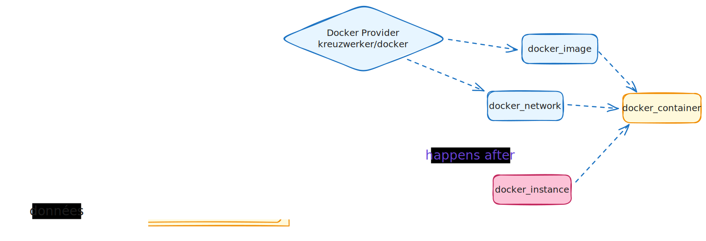

# Projet SpawnIt

**Auteurs :** Massimo Stefani et Timothée Van Hove

## 1. Introduction

SpawnIt est une application «Infrastructure‑as‑Code pour tous» qui s’appuie intégralement sur le moteur d’orchestration OpenTofu (fork communautaire de Terraform). Son objectif: rendre le déploiement et la destruction de services techniques aussi simples qu’un clic, tout en conservant la puissance d’une description déclarative:

> *Décrire l’état voulu plutôt que la procédure pour y parvenir.*

Cette application permet de provisionner des services complets (bases de données, serveurs de jeu, plateformes DevOps, etc.) très facilement, qu'ils soient exécutés localement via Docker ou dans le cloud via AWS EC2.

## 2. Contexte

Nous avons retenu OpenTofu, un moteur d’infrastructure open‑source issu du projet Terraform. Contrairement à Terraform, OpenTofu conserve une licence ouverte et bénéficie du soutien de la Linux Foundation. OpenTofu permet de décrire des infrastructures sous forme de fichiers `.tf` et de piloter leur mise en place avec des commandes simples (`init`, `plan`, `apply`, `destroy`).

Note: Il se peut que vous rencontriez des références à Terraform dans le code ou la documentation.

### 2.1 Application auto‑déployée et double approche IaC / API‑First

SpawnIt n’est pas seulement un orchestrateur d’infrastructure: **il se déploie lui‑même à l’aide d’OpenTofu**. Nous exploitons deux voies complémentaires qui démontrent la flexibilité du projet:

1. **IaC traditionnelle – scripts OpenTofu**: Toute l’infrastructure d’hébergement de SpawnIt (réseau, volumes persistants, conteneurs système, etc.) est décrite dans des modules OpenTofu conservés dans notre dépôt Git (versionnés via tags Git). Des scripts shell (`all-deploy.sh`, `network-deploy.sh`, …) appellent successivement les commandes Opentofu pour créer ou mettre à jour cet environnement.
2. **API‑First – infrastructure «as‑a‑Service»**: Côté utilisateur, aucune ligne de code Terraform n’est exposée. Une requête HTTP décrivant un service est convertie à la volée en un fichier de variables (`.tfvars.json`), Nous avons cherché à répliquer à notre échelle ce que fait AWS avec CloudFormation: décrire une pile, l’appliquer, et obtenir un service prêt à l’emploi sans manipuler directement la couche IaC. On demande une base de données ou un cluster de jeu et, quelques secondes plus tard, le service est opérationnel.

Ce document décrit les deux aspects complémentaires de SpawnIt: d’une part l’architecture de l’infrastructure déployée avec OpenTofu (conteneurs, modules, scripts), et d’autre part la logique métier (API, orchestrateur, interface utilisateur) qui permet à SpawnIt de proposer une expérience « as-a-Service ».

La suite est divisée en deux sections claires: d’abord l’infrastructure (présentée ici), puis la couche métier (plus bas dans ce même document).

## 3. Infrastructure - IaC traditionnelle

### 3.1. Choix Technologiques
Sans providers, un code OpenTofu ne peut rien faire. Nous avons choisi d’utiliser les providers suivants pour répondre à nos besoins :

- Un provider **Docker** pour déployer localement des services dans des conteneurs.
- Un provider **Keycloak** pour deployer un serveur d'authentification et de gestion des utilisateurs.
- Un provider **MinIO** pour déployer un server de stockage compatible S3, qui servira utilisé comme datastore principal pour les états OpenTofu des différentes infrastructures déployées (via la configuration du backend S3 d'OpenTofu). Aussi utilisé pour les configurations de service spécifiques à chaque client et les templates de service de base qui sont servis au frontend.

> [!NOTE] 
>
> Les providers utilisés pour Docker et MinIO ne sont pas des providers officiels, mais des providers communautaires maintenus par la communauté OpenTofu.

### 3.2. Architecture

L’architecture repose sur un découplage entre la présentation, la logique d’orchestration, et l’infrastructure cible. Elle est conçue de manière modulaire et stateless, avec une exécution conteneurisée, un backend unique pilotant OpenTofu, et un stockage persistant via S3. Le backend agit comme point de convergence, en orchestrant toutes les interactions entre les autres composants.

#### Vue d’ensemble des conteneurs

| Conteneur          | Image                          | Volumes persistants |  
| ------------------ | ------------------------------ |---------------------|  
| `spawnit-backend` | `ghcr.io/spawnit/backend` | N/A                 |  
| `spawnit-frontend` | `ghcr.io/spawnit/frontend` | N/A                 |  
| `minio` | `minio/minio:latest` | `minio-data` |  
| `keycloak` | `quay.io/keycloak/keycloak:24` | N/A                 |  


**Backend**

Le backend est une application Node.js conteneurisée, qui expose une API REST et un canal Server-Sent Events (SSE). Il encapsule également l’exécution locale de commandes OpenTofu.

**Frontend**

Le frontend est une application web statique, déployée dans un conteneur Docker distinct. Il ne contient aucune logique métier et ne connaît ni la structure des fichiers Terraform ni l’infrastructure cible. Il interagit exclusivement avec l’API backend.

**S3 (MinIO)**

Le stockage des fichiers est entièrement externalisé sur ce serveur S3.

**Keycloak**

Keycloak est utilisé pour gérer l’authentification des utilisateurs via OpenID Connect. Il permet de sécuriser l’accès à l’interface web. Keycloak est configuré pour fonctionner en mode autonome, avec un volume persistant pour conserver les données des utilisateurs et des configurations.
### 3.3. Déploiement

Pour comprendre le déploiement de SpawnIt, il convient de se concentrer sur les quatre dossiers racine du projet :

- `instances/` contient le code principal pour le déploiement des conteneurs applicatifs (backend, frontend, Keycloak, MinIO).
- `network/` gère la création du réseau Docker utilisé par les différents services.
- `volumes/` définit les volumes Docker persistants nécessaires au bon fonctionnement des services.
- `configs/` configure les services déployés, par exemple la création des buckets MinIO ou l’initialisation d’un realm Keycloak.

Dans chaque dossier, on trouve :
- des fichiers `*.auto.tfvars.json` qui définissent les valeurs propres à l'infrastructure de ce composant ;
- un fichier `variables.tf` qui déclare les variables attendues et fournit leur description ;
- un fichier `main.tf` contenant la logique de provisionnement spécifique à chaque composant.

>[!NOTE] 
> - Les bonnes pratiques OpenTofu recommandent de séparer la déclaration des variables d’entrée (`variables.tf`) de leurs valeurs concrètes (`*.auto.tfvars.json`). Cela permet la réutilisation des modules.
> - Les fichiers `*.auto.tfvars.json` sont chargés automatiquement par OpenTofu lors de l’exécution, ce qui simplifie la gestion des variables par environnement.
> - En principe, il est recommandé de séparer les valeurs par environnement (développement, production, etc.) via des fichiers nommés `*.<env>.auto.tfvars.json`. Cependant, dans notre cas, nous avons choisi de regrouper les variables par module pour simplifier la structure du projet.

Pour automatiser le déploiement de l’application, nous avons mis en place des scripts shell qui encapsulent chacun une étape du provisioning.  Ces scripts n’exécutent pas des commandes Docker, mais appellent systématiquement OpenTofu avec les fichiers de configuration appropriés.

Le script `all-deploy.sh` est le point d’entrée principal. Il déclenche successivement quatre sous-scripts.

- Le script `volumes-deploy.sh` crée les volumes Docker persistants nécessaires à certains services (MinIO, Keycloak).
- Le script `network-deploy.sh` crée le réseau Docker auquel tous les conteneurs applicatifs seront connectés.
- Le script `instances-deploy.sh` déclare les conteneurs de l’application (S3, Backend, Frontend, Keycloak) en utilisant le provider Docker.
- Enfin, `configs-deploy.sh` applique des modules supplémentaires pour injecter des configurations spécifiques dans les services lancés, par exemple la création de buckets dans MinIO ou l’initialisation d’un realm Keycloak.

Chaque script utilise son propre répertoire de travail, appelle `tofu init`, puis applique l’infrastructure avec `tofu apply -auto-approve`. L’approche est modulaire, idempotente et parfaitement compatible avec une intégration CI/CD.

Ce choix a été fait pour garantir que chaque étape du déploiement est indépendante et peut être testée ou modifiée sans affecter les autres. Cette granularité nous permet de détruire ou de mettre à jour des parties spécifiques de l'infrastructure sans avoir à redéployer l'ensemble de l'application.

Pour détruire l’infrastructure, il suffit d'écrire `./all-deploy.sh destroy` dans le terminal. Elle se detruit dans l’ordre inverse de son déploiement.

> [!NOTE] 
> - Avec OpenTofu, il est possible de cibler des ressources précises à détruire ou modifier, mais cela est déconseillé. Une suppression partielle peut rompre les dépendances implicites du graphe d’infrastructure. Des ressources dépendantes risquent de rester orphelines, causant des incohérences difficiles à corriger automatiquement.
> - Un délai de 20 secondes a été introduit entre chaque étape de déploiement pour permettre aux conteneurs de correctement s'initialiser avant de passer à l’étape suivante. Cela évite les erreurs liées à des ressources non prêtes.

  

### 3.4. Modularité et réutilisabilité

La structure du répertoire `modules/` montre une séparation claire des responsabilités, facilitant sa réutilisation.

```  
modules/  
├── common/  
│   ├── configs/  
│   │   ├── idp/  
│   │   │   ├── client/       # Déclaration d'un client Keycloak  
│   │   │   ├── realm/        # Définition d'un realm Keycloak  
│   │   │   └── user/         # Création d'un utilisateur Keycloak  
│   │   └── s3/  
│   │       ├── bucket/       # Création d'un bucket MinIO/S3  
│   │       ├── content/      # Upload de contenu dans un bucket  
│   │       ├── file/         # Ajout de fichier individuel  
│   │       └── folder/       # Création de dossier logique  
│  
├── docker/  
│   ├── instances/            # Lancement d'un conteneur (générique)  
│   ├── network/              # Création d’un réseau Docker  
│   └── volumes/              # Déclaration de volumes Docker  
```
#### 3.4.1. Utilisation concrète : création de dossiers S3
Imaginons que l’on souhaite créer des dossiers dans notre bucket MinIO/S3, par exemple pour organiser les fichiers propres à chaque client. Grâce à la modularité, nous utilisons le même module `folder` pour deux cas d’usage différents :

1. **Création du dossier racine `clients/` :**

```terraform
# Create a "tfstates" folder inside the previously created bucket  
module "s3_folder_create" {  
  source = "../modules/common/configs/s3/folder"  
  providers = {  
  minio = minio.s3  
  }  
  depends_on = [module.s3_bucket_create]  
  
  folder_name = "clients"  
}
```
2. **Création dynamique d’un dossier pour chaque utilisateur :**
```terraform
# Create a folder for each user in the S3 bucket
module "s3_create_client_folder" {  
  source = "../modules/common/configs/s3/folder"  
  providers = {  
  minio = minio.s3  
  }  
  depends_on = [module.s3_bucket_create]  
  
  count       = length(var.default_users)  
  folder_name = "clients/${module.idp_create_users[count.index].user_id}"  
}
```

> [!NOTE]
>
> - Les modules `instances`, `network` et `volumes` sont faits pour être agnostiques vis-à-vis des technologies utilisées (par exemple, Docker ou Podman).
> - Toutefois, cette agnosticité a ses limites : certains éléments comme les `providers` doivent obligatoirement être définis dans le `main.tf` de la racine du projet, car ils ne peuvent pas être abstraits à l'intérieur d’un module.
> - Techniquement, la création du dossier `clients/` n’est pas obligatoire dans S3, car la création des sous-dossiers utilisateurs (`clients/<uuid>/`) crée automatiquement l’arborescence complète. Cependant, cela reste utile comme exemple.

#### 3.4.2. Représentation dans le DAG

Ce découpage clair permet une représentation directe et lisible dans le graphe d'exécution DAG :
```
module.s3_bucket_create
├── module.idp_create_realm
│   └── module.idp_create_users[count.index]
│       └── module.s3_create_client_folder[count.index]
└── module.s3_create_client_folder[count.index] (via depends_on)
```

-   `module.s3_folder_create` ne dépend que du bucket. Il est directement relié à `s3_bucket_create` par un `depends_on`.

-   `module.idp_create_users[count.index]` dépend implicitement du module `idp_create_realm`, car il lui faut le `realm_id`.

-   `module.s3_create_client_folder[count.index]` dépend :

    -   explicitement de `module.s3_bucket_create`

    -   implicitement de `module.idp_create_users[count.index]` car il utilise `user_id`

    -   donc transitivement de `module.idp_create_realm` aussi

### 3.5. DAG et dépendances
Comme expliqué dans la partie théorique, l’un des apports majeurs d’OpenTofu est son moteur d’exécution basé sur un graphe orienté acyclique (DAG). Chaque ressource déclarée dans les fichiers `.tf` devient un nœud dans ce graphe, et les relations de dépendance déterminent l’ordre d’exécution. Regardons un peu ce qui donne les dépendances dans `instances`. On peut le voir en utilisant la commande `tofu graph`:
```bash
digraph {
	compound = "true"
	newrank = "true"
	subgraph "root" {
        // ═══════════════════════════════════════════════════════════════
        // DÉCLARATION DES NOEUDS - Ressources principales
        // ═══════════════════════════════════════════════════════════════
        
        // Ressources Docker du module
        "[root] module.docker_instances.data.docker_network.custom_network (expand)" [label = "module.docker_instances.data.docker_network.custom_network", shape = "box"]
        "[root] module.docker_instances.docker_container.instance (expand)" [label = "module.docker_instances.docker_container.instance", shape = "box"]
        "[root] module.docker_instances.docker_image.instance (expand)" [label = "module.docker_instances.docker_image.instance", shape = "box"]
        
        // Provider Docker - Point central de toutes les opérations Docker
        "[root] provider[\"registry.opentofu.org/kreuzwerker/docker\"]" [label = "provider[\"registry.opentofu.org/kreuzwerker/docker\"]", shape = "diamond"]
        
        // Variables d'entrée du plan racine
        "[root] var.host_aws_access_key_id" [label = "var.host_aws_access_key_id", shape = "note"]
        "[root] var.host_aws_default_region" [label = "var.host_aws_default_region", shape = "note"]
		...
	}
}
```
*(La suite complète du graphe est disponible dans le fichier `./doc/tofu-graph.dot`.)*



> [!NOTE]
>
> - Le graphe est généré par la commande `tofu graph` et peut être visualisé avec des outils comme Graphviz.
> - La représentation graphique "dur" se trouve dans le fichier `./doc/instance_graph_sfdp.svg`. L'image ci-dessus est une version stylisée pour une meilleure lisibilité.

#### 3.5.1. Lecture et interprétation

Le graphe est structuré autour d’un nœud racine, qui représente l’ensemble du plan d’exécution. Les formes du diagramme permettent d’identifier rapidement les différents types de nœuds : les variables sont en vert (icônes type fichier), les données locales apparaissent en violet, les ressources sont en beige, les providers en losange bleu, et les points de début/fin sont cerclés.

Les nœuds les plus structurants de ce graphe sont ceux liés au module `docker_instances`, responsable du déploiement des conteneurs. On observe que les variables utilisateur (nom de l’image, ports, volumes, environnement, etc.) alimentent une étape de transformation locale (`processed_instances`), qui produit une structure exploitable dans le reste du graphe. À partir de là, OpenTofu évalue les dépendances techniques : image à télécharger, réseau Docker à détecter, provider à initialiser, et enfin conteneur à créer.

#### 3.5.2. Points de contrôle critiques

Certaines ressources sont traversées systématiquement par le graphe d’exécution. C’est le cas du provider Docker (`provider["registry.opentofu.org/kreuzwerker/docker"]`), qui agit comme point de passage obligatoire pour toutes les opérations sur les ressources Docker (conteneurs, images, réseaux, volumes). Sa position centrale dans le DAG en fait un nœud de synchronisation incontournable : aucune action Docker ne peut être exécutée tant que ce provider n’a pas été initialisé avec succès.

De la même manière, la ressource `data.docker_network.custom_network` est sollicitée en lecture par tous les conteneurs. Ce n’est pas une création active, mais une interrogation du réseau Docker existant. Comme chaque conteneur fait référence à ce réseau, une indisponibilité ou un nom incorrect à ce niveau bloquerait toute la chaîne de déploiement.

Enfin, `docker_image.instance` représente la récupération de l’image Docker (pull), elle aussi nécessaire à la création de tout conteneur. Ces trois nœuds — provider, réseau, image — structurent le début du plan d’exécution.

**Variables d'entrée** 

Ces variables sont récupérées depuis les variables d'environnement de la machine hôte pour être injectées dans le container.

- `var.host_aws_access_key_id` : authentification AWS pour les ressources hybrides
- `var.host_aws_default_region` : région AWS par défaut
- `var.host_aws_secret_access_key` : clé secrète AWS

#### 3.5.3. Chaîne de dépendances critiques

Le processus de déploiement s’organise en plusieurs phases bien identifiables dans le graphe.

**Phase 1 : Préparation des données**

```
var.* → local.processed_instances → module.docker_instances
```
 Les variables utilisateur sont injectées depuis le fichier `auto.tfvars.json`, puis transformées par un bloc `locals` qui produit une structure `processed_instances`. Cette structure est utilisée dans tout le module pour instancier dynamiquement les ressources.

**Phase 2 : Résolution du réseau**
```
network_name → data.docker_network → containers
```
Avant de pouvoir créer un conteneur, OpenTofu doit s’assurer que le réseau mentionné est existant et accessible. Cela passe par la ressource `data.docker_network`, qui agit comme un prérequis silencieux mais strict.

**Phase 3 : Préparation des images**
```
image_var → docker_image → containers
```
 La ressource `docker_image` s’assure que l’image spécifiée est bien disponible localement (pull si nécessaire). Ce n’est qu’une fois l’image présente que les conteneurs peuvent être instanciés.

**Phase 4 : Création des containers**
```
network + image + variables → docker_container
```
Création effective des conteneurs (`docker_container.instance`), qui dépend de l’ensemble des étapes précédentes. C’est là que convergent les dépendances issues des données, du réseau, de l’image et du provider.

#### 3.5.4. Points de synchronisation

La synchronisation du plan est assurée par les dépendances explicites (via les attributs `depends_on`) et implicites (par référence de ressource). Par exemple, même sans `depends_on` manuel, le fait que `docker_container` utilise `docker_image` dans un attribut `image = ...` suffit à créer une relation dans le DAG.

OpenTofu garantit donc un ordre strict pour la création des conteneurs : les variables sont chargées, le provider Docker est initialisé, le réseau est résolu, l’image est téléchargée, et seulement ensuite les conteneurs sont créés. Cela permet d’éviter les erreurs de type “ressource non prête” tout en laissant OpenTofu maximiser la parallélisation là où c’est possible.

#### 3.5.5. Optimisations

Le DAG généré par SpawnIt permet plusieurs formes d’optimisations.

La récupération des images Docker (`docker_image`) et la lecture du réseau (`data.docker_network`) peuvent être réalisées en parallèle, car elles ne dépendent que de la structure `processed_instances`. De plus, si plusieurs conteneurs doivent être créés à partir d’images différentes ou configurés indépendamment, ces créations peuvent également être parallélisées.

Certains points restent des goulots d’étranglement : le provider Docker est centralisé, et toutes les opérations y transitent ; le réseau doit être résolu avant tout conteneur ; chaque image doit être disponible avant sa première utilisation. Malgré cela, OpenTofu exploite efficacement les chemins parallèles du graphe pour gagner en vitesse dès que c’est possible.

## 4. Infrastructure - API‑First

Dans ce chapitre, on ne parle plus de l’infrastructure qui exécute SpawnIt, mais de celle que SpawnIt déploie en tant que service, via son interface utilisateur.

### 4.1. Choix Technologiques

- Provider AWS pour OpenTofu : Permet la création et la gestion d'instances EC2, de Security Groups.
- Provider Docker pour OpenTofu : Permet la gestion des conteneurs, réseaux et volumes Docker
- Node.js avec Express : Utilisé pour la gestion des routes, des middlewares et des requêtes HTTP.
- Server-Sent Events (SSE) : fournit un retour au client web pendant les opérations OpenTofu (planification, application).
- Next.js (React) : Choisi pour ses capacités de rendu côté serveur, et son écosystème React.
- Material UI : Utilisée comme librairie de composants UI.

### 4.1. Principe et architecture API‑First

L’approche API‑First de SpawnIt vise à abstraire la complexité de Terraform/OpenTofu du point de vue de l’utilisateur. Contrairement à une approche classique où l’utilisateur manipule directement des fichiers `.tf`, ici toutes les opérations sont pilotées via des requêtes HTTP.

Le backend agit comme point d’orchestration central : il transforme les requêtes utilisateurs en configurations Terraform, déclenche localement les opérations `tofu`, et diffuse les résultats en temps réel. Il ne conserve aucun état durable ; toutes les données nécessaires à la reconstitution d’un déploiement sont stockées sur S3 (MinIO).

L’utilisateur ne manipule donc jamais la couche IaC directement. Il choisit un service, renseigne quelques champs dans un formulaire, et le système se charge du reste : génération de la configuration, planification, application, supervision.

### 4.2. Génération dynamique de la configuration

Chaque service déployable dans SpawnIt repose sur un template de configuration (`*.template.tfvars.json`) pré-enregistré dans le dossier `templates/` du bucket S3. Ces fichiers définissent la structure attendue pour instancier un service donné (ex. : base de données, serveur de jeu), en exposant des variables dynamiques typées.

Lorsque l’utilisateur soumet un formulaire via l’interface web, le frontend envoie au backend une requête contenant les valeurs saisies. Le backend récupère le template correspondant, remplit les champs avec les données utilisateur, y ajoute les métadonnées (provider, clientId, serviceId, etc.), et sérialise le tout dans un fichier `terraform.tfvars.json`.


Ce fichier est ensuite stocké dans le chemin S3 suivant :

```
clients/{clientId}/{serviceId}/terraform.tfvars.json
```

À ce stade, aucune commande OpenTofu n’est exécutée. Cette phase ne fait que **préparer une configuration persistée**, qui pourra ensuite être validée, appliquée ou détruite à la demande.

> [!NOTE]
>
> Le backend ne conserve aucune copie locale de ces fichiers : tout repose sur la lecture/écriture depuis S3. Cela garantit une résilience naturelle (statelessness) et une forte cohérence entre les différents composants.

### 4.3. Initialisation du répertoire de travail

Pour chaque opération d’infrastructure (plan, apply, destroy), SpawnIt crée dynamiquement un répertoire de travail local, isolé pour le couple `(clientId, serviceId)`. Ce répertoire est instancié dans :

```
./workdirs/{clientId}/{serviceId}/
```

Le backend y télécharge depuis S3 tous les fichiers nécessaires :

- la configuration (`terraform.tfvars.json`),
- le fichier d’état (`terraform.tfstate`), s’il existe,
- et le backend config (`backend.tf.json`), généré dynamiquement si besoin.

Une fois ce répertoire prêt, la commande `tofu init` est appelée avec les bons paramètres :

- backend de type `s3`,
- nom du bucket (`spawn-it-bucket`),
- chemin du fichier d’état (`clients/{clientId}/{serviceId}/terraform.tfstate`),
- credentials d’accès (MinIO ou AWS) injectés via des variables d’environnement.


Cette initialisation est idempotente. Si elle a déjà été faite pour ce service, elle peut être réutilisée. Sinon, elle est recréée à froid à chaque appel, ce qui permet de garantir que chaque exécution part d’un état propre.

> [!NOTE] 
>
> Ce mode de fonctionnement permet au backend d’être entièrement **stateless** : aucun fichier de configuration ou état n’est conservé durablement côté serveur. Même après un redémarrage, toutes les données peuvent être rechargées depuis S3.


### 4.5. Supervision et gestion des exécutions

Pour détecter des modifications manuelles ou des dérives d’état (ex. : suppression d’un conteneur Docker en dehors de SpawnIt), une planification continue est mise en place pour chaque service actif. Le backend exécute automatiquement un `tofu plan` toutes les 10 secondes sur le service ciblé, et transmet le résultat aux clients connectés. Cela permet à l’utilisateur d’être alerté en temps réel en cas de divergence entre l’état attendu et l’état réel.

Chaque exécution de plan, d’apply ou de destroy est encapsulée dans un job identifié par un UUID unique. Ces jobs sont stockés dans une table en mémoire, ce qui permet de suivre leur progression et de les interrompre à tout moment. Une requête REST dédiée permet par exemple d’interrompre un `plan` ou un `apply` en cours, ce qui déclenche un `SIGTERM` sur le processus enfant associé.


En cas de redémarrage du backend, cette table de jobs est perdue, mais cela n’impacte pas la stabilité globale : les processus sont isolés, et comme l’état est externalisé sur S3, aucun effet secondaire ne persiste.

> [!NOTE]
>
> Ce modèle simple permet d’assurer une supervision efficace sans mécanisme de file ou de stockage distribué.

### 4.6. Abstraction des providers

L’un des gros avantage de SpawnIt est sa capacité à déployer sur plusieurs environnements sans changer la logique métier. Le backend ne contient aucune logique spécifique à un provider donné. Le fonctionnement reste identique que l’on déploie en local (via Docker) ou dans le cloud (via AWS EC2).

Cette abstraction repose sur deux mécanismes :

1. Chaque module Terraform utilisé par SpawnIt respecte une interface commune : les noms de variables, les schémas d’entrée et les conventions de fichiers sont les mêmes, quel que soit le provider (Docker, AWS, etc.).
2. La configuration envoyée par le frontend inclut une propriété `provider`, qui détermine dynamiquement le chemin du module à utiliser (par exemple `services/docker/instance` ou `services/aws/instance`).

Cette structure permet de rajouter un nouveau provider de manière totalement indépendante. Il suffit de créer un nouveau module Terraform respectant l’interface attendue (par exemple `services/k8s/instance` pour Kubernetes), et de l’ajouter au catalogue de services. Aucun changement n’est nécessaire côté backend, ni dans l’interface. Cette approche rend le système particulièrement extensible.

## 5. Discussion et limites

Notre architecture modulaire permet à chaque composant, que ce soit le backend, les modules Terraform, ou les scripts de déploiement d'être facilement réutilisables et extensibles. Le modèle de configuration utilisant les templates et les variables rend l’extension du catalogue de services extrêmement simple. L’ajout d’un nouveau service ne nécessite aucune modification du backend ni du frontend : il suffit de déposer un nouveau fichier template et de l’enregistrer dans le fichier `catalog.json`. Le fait que l'application soit auto-déployable est une preuve de cohérence. Cette boucle fermée illustre bien l’intention initiale du projet de tirer parti de l'interface déclarative pour la gestion d’infrastructure.

Certaines limitations subsistent. La persistance de l’état repose sur le backend S3. Si ce dernier devient indisponible, l’application devient inutilisable, car le backend ne conserve aucun cache local. Ce choix est volontaire (stateless complet), mais introduit une dépendance forte à la disponibilité de S3. Enfin, l’expérience utilisateur peut être altérée en cas d’erreurs de configuration. L’application ne valide pas de manière exhaustive les champs du formulaire utilisateur, ce qui peut provoquer des erreurs à l’exécution de Terraform difficiles à diagnostiquer pour un utilisateur non technique. Ce point pourrait être amélioré par une phase de pré-validation plus stricte côté backend.


## 6. **Conclusion**

Notre projet démontre qu’il est possible de proposer une interface de déploiement légère et déclarative, sans sacrifier la flexibilité ni l’extensibilité. L’approche déclarative a joué un grand rôle dans la structuration du projet. En isolant chaque étape du déploiement et en les décrivant comme des modules indépendants, l’architecture reste lisible, reproductible et facilement testable. Cette structure a également facilité la mise en place de l’auto-hébergement, qui démontre la cohérence du modèle choisi.

Plusieurs perspectives d’évolution sont identifiées. Il serait pertinent d’ajouter le support d’autres providers, tels que Kubernetes, Azure ou GCP, afin d’ouvrir SpawnIt à de nouveaux environnements.  Enfin, l’ajout d’un système de monitoring post-déploiement  même simple permettrait d’offrir un retour d’état en temps réel sans avoir à s’appuyer uniquement sur les plans Terraform.

SpawnIt est donc à la fois une interface de déploiement, une démonstration de l’intérêt du paradigme déclaratif, et une base solide pour expérimenter ou industrialiser des workflows d’orchestration d’infrastructure modernes.
