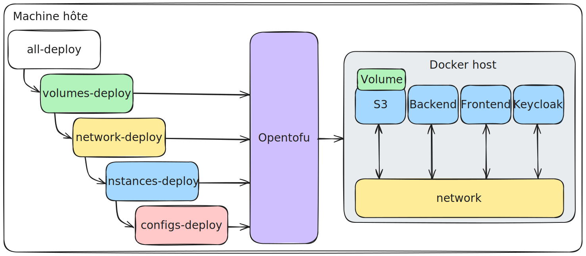

\tableofcontents


\pagebreak


## 1. Introduction

SpawnIt est une application «Infrastructure‑as‑Code pour tous» qui s’appuie intégralement sur le moteur d’orchestration OpenTofu (fork communautaire de Terraform). Son objectif: rendre le déploiement et la destruction de services techniques aussi simples qu’un clic, tout en conservant la puissance d’une description déclarative:

> *Décrire l’état voulu plutôt que la procédure pour y parvenir.*

Cette application permet de provisionner des services complets (bases de données, serveurs de jeu, plateformes DevOps, etc.) très facilement, qu'ils soient exécutés localement via Docker ou dans le cloud via AWS EC2.

## 2. Contexte

Nous avons retenu OpenTofu, un moteur d’infrastructure open‑source issu du projet Terraform. Contrairement à Terraform, OpenTofu conserve une licence ouverte et bénéficie du soutien de la Linux Foundation. OpenTofu permet de décrire des infrastructures sous forme de fichiers `.tf` et de piloter leur mise en place avec des commandes simples (`init`, `plan`, `apply`, `destroy`).

Note: Il se peut que vous rencontriez des références à Terraform dans le code ou la documentation.

### 2.1 Application auto‑déployée et double approche IaC / API‑First

SpawnIt n’est pas seulement un orchestrateur d’infrastructure: il se déploie lui‑même à l’aide d’OpenTofu. Nous exploitons deux voies complémentaires qui démontrent la flexibilité du projet:

1. **IaC traditionnelle – scripts OpenTofu**: Toute l’infrastructure d’hébergement de SpawnIt (réseau, volumes persistants, conteneurs système, etc.) est décrite dans des modules OpenTofu conservés dans notre dépôt Git (versionnés via tags Git). Des scripts shell (`all-deploy.sh`, `network-deploy.sh`, …) appellent successivement les commandes Opentofu pour créer ou mettre à jour cet environnement.
2. **API‑First – «Platform-as‑a‑Service»**: Côté utilisateur, aucune ligne de code Terraform n’est exposée. Une requête HTTP décrivant un service est convertie à la volée en un fichier de variables (`.tfvars.json`), Nous avons cherché à répliquer à notre échelle ce que fait AWS avec CloudFormation: décrire une pile, l’appliquer, et obtenir un service prêt à l’emploi sans manipuler directement la couche IaC. On demande une base de données ou un cluster de jeu et, quelques secondes plus tard, le service est opérationnel.

Ce document décrit les deux aspects complémentaires de SpawnIt: d’une part l’architecture de l’infrastructure déployée avec OpenTofu (conteneurs, modules, scripts), et d’autre part la logique métier (API, orchestrateur, interface utilisateur) qui permet à SpawnIt de proposer une expérience « as-a-Service ».

La suite est divisée en deux sections claires: d’abord l’infrastructure (présentée ici), puis la couche métier (plus bas dans ce même document).

## 3. Infrastructure - IaC traditionnelle

### 3.1. Choix Technologiques

Sans providers, un code OpenTofu ne peut rien faire. Nous avons choisi d’utiliser les providers suivants pour répondre à nos besoins :

- Un provider **Docker** pour déployer localement des services dans des conteneurs.
- Un provider **Keycloak** pour deployer un serveur d'authentification et de gestion des utilisateurs.
- Un provider **MinIO** pour déployer un server de stockage compatible S3, qui servira utilisé comme datastore principal pour les états OpenTofu des différentes infrastructures déployées (via la configuration du backend S3 d'OpenTofu). Aussi utilisé pour les configurations de service spécifiques à chaque client et les templates de service de base qui sont servis au frontend.

Les providers utilisés pour Docker et MinIO ne sont pas des providers officiels, mais des providers communautaires maintenus par la communauté OpenTofu.


\pagebreak


### 3.2. Architecture

L’architecture repose sur un découplage entre la présentation, la logique d’orchestration, et l’infrastructure cible. Elle est conçue de manière modulaire et stateless, avec une exécution conteneurisée, un backend pilotant OpenTofu, et un stockage via S3. Le backend agit comme point de convergence, gérant toutes les interactions entre les autres composants.


\begin{figure}[!htb]
    \centering
    \includegraphics[width=0.7\textwidth]{/home/tim/Documents/PLM/infra/doc/img/structure.png}
\end{figure}


#### Vue d’ensemble des conteneurs

| Conteneur          | Image                          | Volumes persistants |
| ------------------ | ------------------------------ | ------------------- |
| `spawnit-backend`  | `ghcr.io/spawnit/backend`      | N/A                 |
| `spawnit-frontend` | `ghcr.io/spawnit/frontend`     | N/A                 |
| `minio`            | `minio/minio:latest`           | `minio-data`        |
| `keycloak`         | `quay.io/keycloak/keycloak:24` | N/A                 |

**Backend**: Application Node.js conteneurisée, qui expose une API REST et un canal Server-Sent Events (SSE). Il encapsule également l’exécution locale de commandes OpenTofu.

**Frontend**: Application web statique, déployée dans un conteneur Docker distinct. Il ne contient aucune logique métier et ne connaît ni la structure des fichiers Terraform ni l’infrastructure cible. Il interagit exclusivement avec l’API backend.

**S3 (MinIO)**: Le stockage des fichiers est entièrement externalisé sur ce serveur S3.

**Keycloak**: Utilisé pour gérer l’authentification des utilisateurs via OpenID Connect. Il permet de sécuriser l’accès à l’interface web. Keycloak est configuré pour fonctionner en mode autonome, avec un volume persistant pour conserver les données des utilisateurs et des configurations.


Pour des raisons de simplicité et d’uniformité avec le reste de l’infrastructure, nous avons choisi de gérer entièrement Keycloak avec OpenTofu : sa création, mais aussi sa configuration (realms, clients, utilisateurs). Ce choix a une conséquence importante : si l’on détruit la ressource avec tofu destroy, toute la configuration est perdue. Et cela peut poser problème, car notre logique métier repose sur les clientId générés dans Keycloak. En cas de recréation, ces identifiants changent — les nouveaux UID ne correspondent plus à ceux utilisés par les services existants. Les services peuvent continuer à tourner, mais l’application ne peut plus les authentifier : on a alors une perte de référence côté applicatif.

La solution naturelle aurait été d’ajouter un volume persistant sur Keycloak, pour conserver sa configuration entre les redéploiements. Mais nous avons volontairement choisi de ne pas modifier le code à ce stade du projet, afin de garder l’infrastructure telle quelle et de ne pas introduire de changements tardifs. C’est donc un point de vigilance : en l’état actuel, toute destruction de Keycloak implique une perte complète de configuration, et par conséquent une instabilité potentielle de l’infrastructure si des services dépendent encore des anciens identifiants.


\pagebreak


### 3.3. Déploiement

Pour comprendre le déploiement de SpawnIt, il convient de se concentrer sur les quatre dossiers racine du projet :

- `instances/` contient le code pour le déploiement des conteneurs applicatifs (backend, frontend, Keycloak, MinIO).
- `network/` gère la création du réseau Docker utilisé par les différents services.
- `volumes/` définit les volumes Docker persistants nécessaires au bon fonctionnement des services.
- `configs/` configure les services déployés, par exemple la création des buckets MinIO.

Dans chaque dossier, on trouve des fichiers `*.auto.tfvars.json` qui définissent les valeurs de l'infrastructure de ce composant, un fichier `variables.tf` qui déclare les variables attendues et fournit leur description et un fichier `main.tf` contenant la logique de provisionnement spécifique à chaque composant.

Les bonnes pratiques OpenTofu recommandent de séparer la déclaration des variables d’entrée (`variables.tf`) de leurs valeurs concrètes (`*.auto.tfvars.json`). Cela permet la réutilisation des modules. Les fichiers `*.auto.tfvars.json` sont chargés automatiquement par OpenTofu lors de l’exécution, ce qui simplifie la gestion des variables par environnement. En principe, il est recommandé de séparer les valeurs par environnement (développement, production, etc.) via des fichiers nommés `*.<env>.auto.tfvars.json`. Cependant, dans notre cas, nous avons choisi de regrouper les variables par module pour simplifier la structure du projet.

Pour automatiser le déploiement de l’application, nous avons mis en place des scripts shell qui encapsulent chacun une étape du provisioning.  Ces scripts n’exécutent pas des commandes Docker, mais appellent systématiquement OpenTofu avec les fichiers de configuration appropriés.

Le script `all-deploy.sh` est le point d’entrée principal. Il déclenche successivement quatre sous-scripts.

- Le script `volumes-deploy.sh` crée les volumes Docker persistants nécessaires à certains services (MinIO, Keycloak).
- Le script `network-deploy.sh` crée le réseau Docker auquel tous les conteneurs applicatifs seront connectés.
- Le script `instances-deploy.sh` déclare les conteneurs de l’application en utilisant le provider Docker.
- Enfin, `configs-deploy.sh` applique des modules supplémentaires pour injecter des configurations spécifiques dans les services lancés, par exemple la création de buckets dans MinIO ou l’initialisation d’un realm Keycloak.

Chaque script utilise son propre répertoire de travail, appelle `tofu init`, puis applique l’infrastructure avec `tofu apply -auto-approve`. L’approche est modulaire, idempotente et parfaitement compatible avec une intégration CI/CD.

Ce choix a été fait pour garantir que chaque étape du déploiement est indépendante et peut être testée ou modifiée sans affecter les autres. Cette granularité nous permet de détruire ou de mettre à jour des parties spécifiques de l'infrastructure sans avoir à redéployer l'ensemble de l'application. Avec OpenTofu, il est possible de cibler des ressources précises à détruire ou modifier, mais cela est déconseillé. Une suppression partielle peut rompre les dépendances implicites du graphe d’infrastructure. Des ressources dépendantes risquent de rester orphelines, causant des incohérences difficiles à corriger automatiquement. Un délai de 20 secondes a été introduit entre chaque étape de déploiement pour permettre aux conteneurs de correctement s'initialiser avant de passer à l’étape suivante. Cela évite les erreurs liées à des ressources non prêtes.



### 3.3.1. Problème Keycloak

Un détail important à connaître lors du déploiement concerne l’initialisation de Keycloak.
Lorsqu’on exécute ./all-deploy.sh, il arrive que Keycloak ne soit pas encore prêt au moment où le script essaie de le configurer (par exemple pour créer les realms, les utilisateurs ou les clients).
Dans ce cas, certaines étapes de configuration échouent silencieusement ou partiellement, ce qui peut entraîner des incohérences dans l’état final.

Pas besoin de tout supprimer ni de déboguer à la main : il suffit généralement d’attendre quelques secondes que Keycloak termine son démarrage, puis de relancer le script ./all-deploy.sh.
Cela rejouera les étapes de provisioning, de manière idempotente (grâce à OpenTofu), et appliquera correctement les configurations manquantes.

Ce même problème peut aussi se produire au moment où le backend Node.js démarre : il tente de créer un singleton client Keycloak.
S’il échoue parce que Keycloak n’est pas encore prêt, il garde un singleton invalide en mémoire.
Là encore, la solution est simple : relancer le conteneur spawn-it-backend une fois Keycloak prêt, avec 

Pour corriger ça, il suffit d’attendre que Keycloak soit bien initialisé, puis de redémarrer uniquement le conteneur du backend avec la commande suivante :
```bash
docker restart spawn-it-backend
```


### 3.4. Modularité et réutilisabilité

La structure du répertoire `modules/` montre une séparation claire des responsabilités, facilitant sa réutilisation.

```  bash
modules/  
├── common/  
│   ├── configs/  
│       ├── idp/  
│       │   ├── client/       # Déclaration d'un client Keycloak  
│       │   ├── realm/        # Définition d'un realm Keycloak  
│       │   └── user/         # Création d'un utilisateur Keycloak  
│       └── s3/  
│           ├── bucket/       # Création d'un bucket MinIO/S3  
│           ├── content/      # Upload de contenu dans un bucket  
│           ├── file/         # Ajout de fichier individuel  
│           └── folder/       # Création de dossier logique  
├── docker/  
│   ├── instances/            # Lancement d'un conteneur (générique)  
│   ├── network/              # Création d’un réseau Docker  
│   └── volumes/              # Déclaration de volumes Docker  
```


\pagebreak


#### 3.4.1. Utilisation concrète : création de dossiers S3

Imaginons que l’on souhaite créer des dossiers dans notre bucket MinIO/S3, par exemple pour organiser les fichiers propres à chaque client. Grâce à la modularité, nous utilisons le même module `folder` pour deux cas d’usage différents :

1. **Création du dossier racine `clients/` :**

```ini
# Create a "tfstates" folder inside the previously created bucket  
module "s3_folder_create" {  
  source = "../modules/common/configs/s3/folder"  
  providers = {  
  minio = minio.s3  
  }  
  depends_on = [module.s3_bucket_create]  
  folder_name = "clients"  
}
```

2. **Création dynamique d’un dossier pour chaque utilisateur :**

```ini
# Create a folder for each user in the S3 bucket
module "s3_create_client_folder" {  
  source = "../modules/common/configs/s3/folder"  
  providers = {  
  minio = minio.s3  
  }  
  depends_on = [module.s3_bucket_create]  
  count       = length(var.default_users)  
  folder_name = "clients/${module.idp_create_users[count.index].user_id}"  
}
```

Les modules `instances`, `network` et `volumes` sont faits pour être agnostiques vis-à-vis des technologies utilisées (par exemple, Docker ou Podman). Toutefois, cette agnosticité a ses limites : certains éléments comme les `providers` doivent obligatoirement être définis dans le `main.tf` de la racine du projet, car ils ne peuvent pas être abstraits à l'intérieur d’un module. Techniquement, la création du dossier `clients/` n’est pas obligatoire dans S3, car la création des sous-dossiers utilisateurs (`clients/<uuid>/`) crée automatiquement l’arborescence complète. Cependant, cela reste utile comme exemple.

\pagebreak

#### 3.4.2. Représentation dans le DAG

Ce découpage clair permet une représentation directe et lisible dans le graphe d'exécution DAG :

```bash
module.s3_bucket_create
├── module.idp_create_realm
│   └── module.idp_create_users[count.index]
│       └── module.s3_create_client_folder[count.index]
└── module.s3_create_client_folder[count.index] (via depends_on)
```

-   `module.s3_folder_create` ne dépend que du bucket. Il est directement relié à `s3_bucket_create` par un `depends_on`.

-   `module.idp_create_users[count.index]` dépend implicitement du module `idp_create_realm`, car il lui faut le `realm_id`.

-   `module.s3_create_client_folder[count.index]` dépend :

    -   explicitement de `module.s3_bucket_create`

    -   implicitement de `module.idp_create_users[count.index]` car il utilise `user_id`

    -   donc transitivement de `module.idp_create_realm` aussi

### 3.5. DAG et dépendances

Comme expliqué dans la partie théorique, l’un des apports majeurs d’OpenTofu est son moteur d’exécution basé sur un graphe orienté acyclique (DAG). Chaque ressource déclarée dans les fichiers `.tf` devient un nœud dans ce graphe, et les relations de dépendance déterminent l’ordre d’exécution. Regardons un peu ce qui donne les dépendances dans `instances`. On peut le voir en utilisant la commande `tofu graph`:

```bash
digraph {
	compound = "true"
	newrank = "true"
	subgraph "root" {       
        // Ressources Docker du module
        "[root] module.docker_instances.data.docker_network.custom_network (expand)" [label = "module.docker_instances.data.docker_network.custom_network", shape = "box"]
        "[root] module.docker_instances.docker_container.instance (expand)" [label = "module.docker_instances.docker_container.instance", shape = "box"]
        "[root] module.docker_instances.docker_image.instance (expand)" [label = "module.docker_instances.docker_image.instance", shape = "box"]
        
        // Provider Docker - Point central de toutes les opérations Docker
        "[root] provider[\"registry.opentofu.org/kreuzwerker/docker\"]" [label = "provider[\"registry.opentofu.org/kreuzwerker/docker\"]", shape = "diamond"]
        ...
	}
}
```

*(La suite complète du graphe est disponible dans le fichier `./doc/tofu-graph.dot`.)*


Le graphe est généré par la commande `tofu graph` et peut être visualisé avec des outils comme Graphviz. La représentation graphique "dur" se trouve dans le fichier `./doc/graph_sfdp.svg`. L'image ci-dessus est une version stylisée pour une meilleure lisibilité.

#### 3.5.1. Lecture et interprétation

Les nœuds les plus structurants de ce graphe sont ceux liés au module `docker_instances`, responsable du déploiement des conteneurs. On observe que les variables utilisateur (nom de l’image, ports, volumes, environnement, etc.) (se trouvant dans `instances`) alimentent une étape de transformation locale (`processed_instances`), qui produit une structure exploitable dans le reste du graphe. À partir de là, OpenTofu évalue les dépendances techniques : image à télécharger, réseau Docker à détecter, provider à initialiser, et enfin conteneur à créer.

#### 3.5.2. Points de contrôle critiques

Certaines ressources sont traversées systématiquement par le graphe d’exécution. C’est le cas du provider Docker (`provider["registry.opentofu.org/kreuzwerker/docker"]`), qui agit comme point de passage obligatoire pour toutes les opérations sur les ressources Docker (conteneurs, images, réseaux, volumes). Sa position centrale dans le DAG en fait un nœud de synchronisation incontournable : aucune action Docker ne peut être exécutée tant que ce provider n’a pas été initialisé avec succès.

De la même manière, la ressource `data.docker_network.custom_network` est sollicitée en lecture par tous les conteneurs. Ce n’est pas une création active, mais une interrogation du réseau Docker existant. Comme chaque conteneur fait référence à ce réseau, une indisponibilité ou un nom incorrect à ce niveau bloquerait toute la chaîne de déploiement.

Enfin, `docker_image.instance` représente la récupération de l’image Docker (pull), elle aussi nécessaire à la création de tout conteneur. Ces trois nœuds — provider, réseau, image — structurent le début du plan d’exécution.


Pour déployer des ressources sur des providers cloud, nous avons besoins de credentials. Ces derniers sont définis dans la machine hôte (variables d'environnement). Lors du déploiement, les variables d'enviornnement sont récupérées depuis l'hôte et sont injectées dans le container backend.

- `var.host_aws_access_key_id` : authentification AWS pour les ressources hybrides
- `var.host_aws_default_region` : région AWS par défaut
- `var.host_aws_secret_access_key` : clé secrète AWS


\pagebreak


#### 3.5.3. Chaîne de dépendances critiques

Le processus de déploiement s’organise en plusieurs phases bien identifiables dans le graphe.

**Phase 1 : Préparation des données**

```
var.* → local.processed_instances → module.docker_instances
```

 Les variables utilisateur sont injectées depuis le fichier `auto.tfvars.json`, puis transformées par un bloc `locals` qui produit une structure `processed_instances`. Cette structure est utilisée dans tout le module pour instancier dynamiquement les ressources.

**Phase 2 : Résolution du réseau**

```
network_name → data.docker_network → containers
```

Avant de pouvoir créer un conteneur, OpenTofu doit s’assurer que le réseau mentionné est existant et accessible. Cela passe par la ressource `data.docker_network`, qui agit comme un prérequis silencieux mais strict.

**Phase 3 : Préparation des images**

```
image_var → docker_image → containers
```

 La ressource `docker_image` s’assure que l’image spécifiée est bien disponible localement (pull si nécessaire). Ce n’est qu’une fois l’image présente que les conteneurs peuvent être instanciés.

**Phase 4 : Création des containers**

```
network + image + variables → docker_container
```

Création effective des conteneurs (`docker_container.instance`), qui dépend de l’ensemble des étapes précédentes. C’est là que convergent les dépendances issues des données, du réseau, de l’image et du provider.

#### 3.5.4. Points de synchronisation

La synchronisation du plan est assurée par les dépendances explicites (via les attributs `depends_on`) et implicites (par référence de ressource). Par exemple, même sans `depends_on` manuel, le fait que `docker_container` utilise `docker_image` dans un attribut `image = ...` suffit à créer une relation dans le DAG.

#### 3.5.5. Optimisations

Le DAG généré par SpawnIt permet plusieurs formes d’optimisations.

La récupération des images Docker (`docker_image`) et la lecture du réseau (`data.docker_network`) peuvent être réalisées en parallèle, car elles ne dépendent que de la structure `processed_instances`. De plus, si plusieurs conteneurs doivent être créés à partir d’images différentes ou configurés indépendamment, ces créations peuvent également être parallélisées.

Certains points restent des goulots d’étranglement : le provider Docker est centralisé, et toutes les opérations y transitent ; le réseau doit être résolu avant tout conteneur ; chaque image doit être disponible avant sa première utilisation. Malgré cela, OpenTofu exploite efficacement les chemins parallèles du graphe pour gagner en vitesse dès que c’est possible.


\pagebreak


## 4. Infrastructure - API‑First

Dans ce chapitre, on ne parle plus de l’infrastructure qui exécute SpawnIt, mais de celle que SpawnIt déploie en tant que service, via son interface utilisateur.

### 4.1. Choix Technologiques

- Provider AWS pour OpenTofu : Permet la création et la gestion d'instances EC2, de Security Groups.
- Provider Docker pour OpenTofu : Permet la gestion des conteneurs, réseaux et volumes Docker
- Node.js avec Express : Utilisé pour la gestion des routes, des middlewares et des requêtes HTTP.
- Server-Sent Events (SSE) : fournit un retour au client web pendant les opérations OpenTofu (plan, apply).
- Next.js (React) : Choisi pour ses capacités de rendu côté serveur, et son écosystème React.
- Material UI : Utilisée comme librairie de composants UI.

Les utilisateurs pour pouvoir utiliser l'application:
````json
{
  "default_users": [
    {
      "username": "alice.dubois",
      "password": "ChangeMe123!"
    },
    {
      "username": "bob.martin",
      "password": "ChangeMe123!"
    },
    {
      "username": "charlie.dupont",
      "password": "ChangeMe123!"
    }
  ]
}
````

### 4.1. Principe et architecture API‑First

L’approche API‑First de SpawnIt vise à abstraire la complexité de Terraform/OpenTofu du point de vue de l’utilisateur. Contrairement à une approche classique où l’utilisateur manipule directement des fichiers `.tf`, ici toutes les opérations sont pilotées via des requêtes HTTP.

Le backend applicatif agit comme point d’orchestration central : il transforme les requêtes utilisateurs en configurations Terraform, déclenche localement les opérations `tofu`, et diffuse les résultats en temps réel. Il ne conserve aucun état durable ; toutes les données nécessaires à la reconstitution d’un déploiement sont stockées sur S3 (MinIO).

L’utilisateur ne manipule donc jamais la couche IaC directement. Il choisit un service, renseigne quelques champs dans un formulaire, et le système se charge du reste : génération de la configuration, planification, application, supervision.

\begin{figure}[!htb]
    \centering
    \includegraphics[width=0.35\textwidth]{/home/tim/Documents/PLM/infra/doc/img/containers.png}
\end{figure}

### 4.2. Le backend OpenTofu

Pour comprendre la suite, il est important de s'attarder sur le fonctionnement du backend OpenTofu.

Dans l'écosystème Terraform/OpenTofu, le backend désigne le mécanisme de stockage et de gestion de l'état de l'infrastructure (fichier `terraform.tfstate`). Ce fichier contient la représentation complète de l'infrastructure déployée : quelles ressources existent, leurs propriétés actuelles, et les métadonnées nécessaires à leur gestion.

#### 4.2.1. Problématique de l'état partagé

Par défaut, OpenTofu stocke l'état localement dans le dossier de travail. Cette approche fonctionne pour un développeur isolé, mais pose rapidement des problèmes dans un contexte collaboratif ou distribué :

- Concurrence : plusieurs utilisateurs ne peuvent pas modifier simultanément la même infrastructure
- Persistance : l'état local est perdu en cas de suppression du répertoire de travail

Pour contourner ces limitations, OpenTofu propose des backends distants, qui permettent de stocker l'état dans un service externe (S3, HTTP, Azure Blob, etc.).

#### 4.2.2. Configuration basique d'un backend S3

Pour cela, il suffit de définir dans le `main.tf` :

```ini
terraform {
  backend "s3" {
    bucket = "mon-bucket-terraform"
    key    = "chemin/vers/terraform.tfstate"
    region = "us-west-2"
  }
}
```

Cette configuration indique à OpenTofu de stocker l'état dans un bucket S3 plutôt que localement.  Lors d'un `tofu init`, OpenTofu configure automatiquement la connexion au backend et migre l'état existant si nécessaire.

Malheureusement, cette approche statique ne convient pas entièrement à SpawnIt, car elle nécessite de stocker l'état dans un bucket S3 spécifique avec un chemin fixe, ce qui n'est pas compatible avec notre modèle de multi-tenancy. Chaque client doit pouvoir gérer ses propres services sans interférer avec les autres.  Il faut donc une approche plus flexible, qui permette de créer dynamiquement des chemins S3 pour chaque client et service.

#### 4.2.3. Backend S3 personnalisé

Pour répondre à ce besoin, SpawnIt utilise une configuration backend partiellement vide qui sera complétée dynamiquement à l'exécution. Dans les modules de service, nous déclarons simplement :

```ini
terraform {
  backend "s3" {}
}
```

Cette déclaration minimale indique à OpenTofu qu'un backend S3 sera utilisé, mais sans spécifier les paramètres de connexion. Ces derniers sont fournis ultérieurement via les arguments de la commande `tofu init`.

#### 4.2.4. Injection dynamique des paramètres

Lors de l'initialisation du répertoire de travail, le backend applicatif SpawnIt injecte dynamiquement les paramètres de connexion via les options `-backend-config` :

```bash
tofu init \
    -backend-config=bucket=${process.env.S3_BUCKET} \
    -backend-config=key=clients/${this.clientId}/${this.serviceId}/terraform.tfstate \
    -backend-config=region=${process.env.S3_REGION} \
    -backend-config=endpoint=${process.env.S3_URL} \
    -backend-config=access_key=${process.env.S3_ACCESS_KEY} \
    -backend-config=secret_key=${process.env.S3_SECRET_KEY} \
    -backend-config=skip_credentials_validation=true \
    -backend-config=skip_metadata_api_check=true \
    -backend-config=force_path_style=true
```

Cette approche présente plusieurs avantages :

- Isolation complète : chaque service dispose de son propre fichier d'état (clients/{clientId}/{serviceId}/terraform.tfstate)
- Sécurité : les credentials ne sont jamais stockés dans les fichiers de configuration
- Compatibilité MinIO : les options skip_* et force_path_style permettent l'utilisation avec MinIO au lieu d'AWS S3


\pagebreak


### 4.3. Isolation des répertoires de travail

Les problèmes liés à la concurrence ne sont pas tous résolus par l'utilisation d'un backend distant. 
Il faut souligner que chaque opération `tofu init` crée un dossier `.terraform/` dans le répertoire de travail local, qui contient les modules, providers, et métadonnées nécessaires à l'exécution.

Le problème réside dans le fait qu'à chaque `tofu init`, les dossiers et fichiers locaux sont recréés ou écrasés, ce qui pose problème si plusieurs utilisateurs tentent d'exécuter des commandes OpenTofu en parallèle sur le même working directory. Cela peut conduire à :

- Conflits de fichiers : corruption du dossier `.terraform/` lors d'écritures simultanées
- Incohérences de versions : un utilisateur pourrait utiliser des providers/modules différents de ceux attendus
- Échecs d'initialisation : erreurs de verrouillage de fichiers lors d'opérations concurrentes

Pour éviter ces conflits, SpawnIt crée dynamiquement un répertoire de travail unique pour chaque couple (clientId, serviceId). OpenTofu offre la possibilité de changer le répertoire de travail via l'option -chdir :

```bash
tofu init -chdir=./workdirs/${this.clientId}/${this.serviceId} ...
```

SpawnIt organise ses répertoires de travail selon la hiérarchie suivante :

```bash
./workdirs/
├── client-uuid-1/
│   ├── service-uuid-a/
│   │   ├── .terraform/           # Métadonnées OpenTofu locales
│   │   ├── terraform.tfvars.json # Variables du service
│   └── service-uuid-b/
│       └── ...
└── client-uuid-2/
    └── ...
```

Avantages de cette approche

- Isolation totale : chaque service possède son environnement d'exécution dédié
- Parallélisation sûre : plusieurs opérations peuvent s'exécuter simultanément sans conflit
- Débogage facilité : chaque répertoire conserve l'historique des fichiers de travail
- Nettoyage sélectif : possibilité de supprimer les répertoires de travail obsolètes sans affecter les autres


Cycle de vie des répertoires de travail
Le backend SpawnIt gère automatiquement le cycle de vie de ces répertoires :

- Création à la demande : un nouveau répertoire est créé lors de la première opération sur un service
- Réutilisation : les opérations suivantes réutilisent le répertoire existant si la configuration n'a pas changé
- Synchronisation : avant chaque opération, les fichiers nécessaires sont téléchargés depuis S3
- Nettoyage périodique : les répertoires non utilisés depuis X jours pourraient être supprimés automatiquement

SpawnIt n'implémente pas toutes ces fonctionnalités de nettoyage, or cela pourrait être une amélioration future.

Bien que nous ayons réussi à diminuer les risques de conflits grâce à l'isolation des répertoires de travail, il est important de noter que cette approche présente encore des limitations. Nous n'avons pas mis en place de mécanisme de verrouillage au niveau applicatif pour gérer les accès concurrentiels sur un même service. Le risque de corruption du dossier .terraform/ persiste si un utilisateur tente d'exécuter deux commandes OpenTofu en parallèle sur le même service (par exemple, un plan et un apply simultanés).


\pagebreak


#### 4.3.1. Le mutex applicatif

Nous avons mis en place un mécanisme de verrouillage applicatif pour éviter les conflits liés à l’exécution simultanée  de commandes OpenTofu sur un même service. Ce choix a été motivé par la nature non thread-safe d’OpenTofu : lancer plusieurs commandes (plan, apply, destroy) en parallèle dans le même répertoire de travail peut corrompre le dossier .terraform/ ou provoquer des erreurs d’état difficiles à diagnostiquer.

Pour garantir qu'une seule opération soit active à la fois pour un service donné, nous avons utilisé le module async-lock dans notre service central (TofuService). Chaque couple {clientId}:{serviceId} est associé à un verrou unique. 

Toute commande OpenTofu doit acquérir ce verrou avant de s’exécuter.

```javascript
const AsyncLock = require('async-lock');
const actionLock = new AsyncLock();

await actionLock.acquire(`${clientId}:${serviceId}`, async () => {
  await OpentofuExecutor.executeAction(...);
}, { timeout: 15 * 60 * 1000 });
```

Ce verrou protège l’ensemble de la séquence critique : synchronisation des fichiers, exécution des commandes, gestion du state, etc. Il garantit l’intégrité des opérations tout en permettant une exécution parallèle entre services distincts.

Maintenant que les bases sont posées, nous pouvons aborder le fonctionnement détaillé de SpawnIt, en commençant par la génération dynamique des configurations de service.

### 4.4. Génération dynamique de la configuration

Chaque service déployable dans SpawnIt repose sur un template de configuration (`*.template.tfvars.json`) pré-enregistré dans le dossier `templates/` du bucket S3. Ces fichiers définissent la structure attendue pour instancier un service  donné (ex. : base de données, serveur de jeu).

Lorsque l’utilisateur soumet un formulaire via l’interface web, le frontend envoie au backend une requête contenant les valeurs saisies. Le backend récupère le configuration correspondant, ajoute des données de la logique métier et sérialise le tout dans un fichier `terraform.tfvars.json`.

\begin{figure}[!htb]
    \centering
    \includegraphics[width=0.5\textwidth]{/home/tim/Documents/PLM/infra/doc/img/config.png}
\end{figure}

Ce fichier est ensuite stocké dans le chemin S3 suivant :

```
clients/{clientId}/{serviceId}/terraform.tfvars.json
```

À ce stade, aucune commande OpenTofu n’est exécutée. Cette phase ne fait que **préparer une configuration persistée**, qui pourra ensuite être validée, appliquée ou détruite à la demande.

Le backend applicatif utilise un modèle "sync before run". Une copie locale de ces fichiers dans le répertoire de travail dans le but de faciliter  l'injection des variables au code OpenTofu lors d'une exécution et la visualisation de son contenu. A chaque `tofu plan / apply / destroy`, le backend télécharge le dossier  /workdirs/<clientId>/<serviceId>/ en entier.Cela n'empêche pas de détruire le backend applicatif sans crainte, car les fichiers de configuration sont persistés dans S3.


\pagebreak


### 4.5. Initialisation du répertoire de travail

Le backend applicatif SpawnIt utilise un modèle "sync before run" pour garantir la cohérence et la traçabilité des déploiements. Cette approche consiste à maintenir une copie locale de tous les fichiers nécessaires dans le répertoire de travail, facilitant ainsi l'injection des variables dans le code OpenTofu lors d'une exécution et la visualisation de son contenu pour le débogage.

#### 4.5.1. Processus de synchronisation

Avant chaque exécution de commande OpenTofu `tofu plan / apply / destroy`, le backend applicatif suit un processus rigoureux de synchronisation.


- Téléchargement complet : Le contenu du dossier S3 `clients/{clientId}/{serviceId}/` est entièrement téléchargé dans le  répertoire local `./workdirs/{clientId}/{serviceId}/`
- Reconstruction de l'environnement : Tous les fichiers nécessaires sont reconstitués localement :
  - terraform.tfvars.json : variables spécifiques au service
  - info.json : fichier métadonnées contenant des informations sur le service (clientId, serviceId, etc.) (Pas nécessaire mais utilisé pour la supervision et le suivi)
- Exécution de `tofu init` : Le backend initialise le répertoire de travail avec les paramètres appropriés pour le backend S3.  Cette initialisation est idempotente, elle peut être recréée à froid à chaque appel, ce qui permet de garantir que chaque exécution part d’un état propre.
- Exécution de la commande OpenTofu : Une fois le répertoire de travail prêt, la commande `tofu plan`, `tofu apply` ou `tofu destroy` est exécutée.


\begin{figure}[!htb]
    \centering
    \includegraphics[width=0.4\textwidth]{/home/tim/Documents/PLM/infra/doc/img/workdir.png}
\end{figure}


Un fichier `terraform.tfstate` est créé dans le répertoire de travail, mais il n'est pas utilisé pour la persistance de l'état. Il est généré pour respecter la structure attendue par OpenTofu, mais l'état réel est stocké dans S3. Il est donc effaçable sans impact. Le backend applicatif est donc totalement stateless.


\pagebreak


### 4.6. Supervision et gestion des exécutions

Pour détecter des modifications manuelles ou des dérives d’état (ex. : suppression d’un conteneur Docker en dehors de SpawnIt), une planification continue est mise en place pour chaque service actif. Le backend exécute automatiquement un `tofu plan`  toutes les 10 secondes sur le service ciblé, et transmet le résultat aux clients connectés. Cela permet à l’utilisateur d’être alerté en temps réel en cas de divergence entre l’état attendu et l’état réel.

Chaque exécution de plan, d’apply ou de destroy est encapsulée dans un job identifié par un UUID unique. Ces jobs sont  stockés dans une table en mémoire, ce qui permet de suivre leur progression et de les interrompre à tout moment. Une requête REST dédiée permet par exemple d’interrompre un `plan` ou un `apply` en cours, ce qui déclenche un `SIGTERM` sur le processus enfant associé.


\begin{figure}[!htb]
    \centering
    \includegraphics[width=0.5\textwidth]{/home/tim/Documents/PLM/infra/doc/img/plan.png}
\end{figure}


En cas de redémarrage du backend, cette table de jobs est perdue, mais cela n’impacte pas la stabilité globale : les processus sont isolés, et comme l’état est externalisé sur S3, aucun effet secondaire ne persiste.

Un service est considéré comme "divergent" si est seulement si :

- Son état réel (infrastructure déployée) ne correspond pas à l'état attendu (configuration stockée)
- ET la dernière opération enregistrée n'est pas cohérente avec l'état observé

Exemples de divergence :

- Configuration marquée "applied": true (dernière opération = apply) mais tofu plan détecte des ressources manquantes
- Configuration marquée "applied": false (dernière opération = destroy) mais tofu plan détecte des ressources existantes

### 4.7. Abstraction des providers cloud

L’un des gros avantage de SpawnIt est sa capacité à déployer sur plusieurs environnements sans changer la logique métier.  Le backend ne contient aucune logique spécifique à un provider donné. Le fonctionnement reste identique que l’on déploie  en local (via Docker) ou dans le cloud (via AWS EC2).

Cette abstraction repose sur deux mécanismes :

1. Chaque module Terraform utilisé par SpawnIt respecte une interface commune : les noms de variables, les schémas  d’entrée et les conventions de fichiers sont les mêmes, quel que soit le provider (Docker, AWS, etc.).
2. La configuration envoyée par le frontend inclut une propriété `provider`, qui détermine dynamiquement le chemin du  module à utiliser (par exemple `services/docker/instance` ou `services/aws/instance`).

Cette structure permet de rajouter un nouveau provider de manière totalement indépendante. Il suffit de créer un  nouveau module Terraform respectant l’interface attendue (par exemple `services/k8s/instance` pour Kubernetes en utilisant le provider source = "hashicorp/kubernetes"), et de  l’ajouter au catalogue de services. Aucun changement n’est nécessaire côté backend, ni dans l’interface. Cette approche rend le système particulièrement extensible.


\pagebreak


## 5. Retour d’expérience

OpenTofu remplit globalement ses promesses : il permet de décrire l’état désiré de l’infrastructure de manière déclarative et de s’en approcher automatiquement via des commandes simples comme plan, apply et destroy. Pour notre projet, il a parfaitement répondu au besoin d’orchestration, en offrant une structuration claire et modulaire. Cependant, dès que la logique devient un peu plus complexe (conditions, boucles imbriquées, gestion dynamique des ressources), la syntaxe HCL montre ses limites : elle devient verbeuse, difficile à appréhender, et peu adaptée à exprimer des comportements conditionnels riches.
On atteint vite les limites dès qu’on veut modéliser une logique plus abstraite. Il manque une vraie notion de programmabilité : on ne peut pas construire des modules dynamiques ou composer des ressources proprement sans duplication.

C’est déclaratif, mais peu expressif dès qu’on sort des cas simples. Un autre point problématique est la
directive lifecycle.prevent_destroy, censée empêcher la suppression accidentelle de ressources. En réalité, elle n'empêche pas la destruction, mais fait échouer l’exécution avec une erreur bloquante — ce qui n'empêche pas l’état d’être modifié ou le plan de diverger, et ne protège donc pas réellement l’infrastructure : cela interrompt juste brutalement l’opération.

Enfin, l’absence de notion intégrée de readiness (par exemple pour attendre qu’un conteneur soit réellement prêt ou qu’un bucket soit utilisable) nous a forcés à bricoler des délais fixes ou des modules spécifiques — une lacune importante pour un outil d’orchestration censé automatiser de bout en bout.

L’un des aspects les plus déroutants d’OpenTofu est son fort couplage aux providers, qui sont responsables de l’interprétation et de l’exécution des ressources déclarées. Cette dépendance peut devenir problématique : certains providers se donnent la liberté de modifier automatiquement les attributs d’une ressource immédiatement après sa création (par exemple, en injectant des valeurs par défaut ou en réinterprétant certaines options). Cela crée un effet en chaîne lors d’un plan suivant : OpenTofu détecte un écart entre l’état réel et la configuration initiale, et propose alors de détruire et recréer la ressource, même si aucune modification fonctionnelle n’a été faite. 

Dans certains cas, cela peut mener à une boucle infinie de replanification, sans jamais atteindre un "état stable". Il existe un mécanisme pour contourner cela : l’attribut lifecycle { ignore_changes = [...] } permet d’ignorer certains champs lors de la comparaison entre l’état souhaité et l’état réel. Mais à partir du moment où l’on commence à ignorer des attributs pour stabiliser l’état, on s’éloigne du modèle déclaratif pur : on cesse de décrire précisément l’état désiré, et on demande simplement au moteur de “ne pas regarder ici”. Cela peut créer une illusion de stabilité tout en masquant des incohérences réelles.

Le paradigme déclaratif s’est révélé extrêmement puissant dans le cadre de notre projet. Il permet de se concentrer sur l’état final désiré sans avoir à décrire étape par étape comment y parvenir. Plutôt que de gérer toute la logique de comment atteindre cet état, on peut entièrement déléguer cette responsabilité au moteur d’exécution. Cette approche favorise une meilleure lisibilité, une reproductibilité forte, et une structuration claire de l’infrastructure. Elle facilite également l’auto-documentation du système : en lisant un fichier .tf, on comprend immédiatement l’intention. 

Cependant, cette simplicité apparente cache une rigidité dès qu’on veut modéliser des comportements dynamiques ou dépendants du contexte d’exécution. Contrairement à une approche impérative où l’on peut facilement injecter des conditions, des boucles ou des structures dynamiques, le déclaratif impose un cadre figé. Cela oblige parfois à des contournements verbeux ou à une duplication excessive. On perd ainsi en expressivité ce qu’on gagne en simplicité.

Pour des infrastructures simples ou standardisées, le déclaratif est un atout évident. Mais dès qu’on veut aller vers des comportements adaptatifs ou conditionnels, ses limites deviennent claires.


\pagebreak


## 6. Améliorations possibles

- Sécurisation de l’API : actuellement, l’API est ouverte et ne vérifie pas systématiquement le token. Une validation
  systématique de l’authentification permettrait de mieux sécuriser l’accès aux opérations sensibles.

- Gestion des UUID : les identifiants clientId et serviceId sont générés aléatoirement sans vérifier s’ils existent déjà. Même si le risque de collision est faible, une vérification explicite permettrait d’éviter des comportements indéterminés.

- Ajout de nouveaux fournisseurs : intégrer des providers supplémentaires comme Kubernetes, Azure ou GCP permettrait d’élargir les possibilités de déploiement sans changer la logique métier, grâce à l’architecture modulaire déjà en place.

- Amélioration de la gestion réseau et volumes :
  - Le réseau Docker est créé à la volée s’il n’existe pas, mais reste totalement invisible dans l’interface — il pourrait être géré plus explicitement.
  - Certains volumes sont déclarés dans les variables mais ne sont pas réellement créés ou utilisés dans les services déployés, ce qui pourrait être clarifié ou automatisé.

- Support d’ECS (Elastic Container Service) : bien que nous utilisions EC2 (grâce à un quota gratuit), l’utilisation d’ECS pourrait simplifier et optimiser le déploiement de conteneurs dans le cloud à l’avenir.

## 7. **Conclusion**

Avec SpawnIt, nous avons cherché à réunir deux mondes souvent séparés : celui du développement logiciel, orienté expérience utilisateur, et celui de l’infrastructure cloud, souvent technique et peu accessible.
En combinant Infrastructure-as-Code, logique déclarative, API web et orchestration automatisée, nous avons conçu une plateforme capable de déployer des services complexes à la demande, en toute simplicité. OpenTofu s’est révélé un outil puissant pour exprimer l’intention d’infrastructure, bien que parfois limité dans les cas complexes où la logique dynamique ou les spécificités des providers créent des frictions. Notre application illustre concrètement ce qu’il est possible d’accomplir avec une bonne intégration d’OpenTofu et un paradigme déclaratif.

